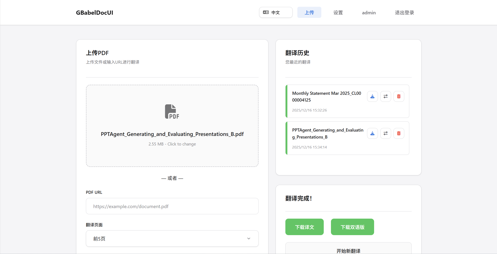

# GBabelDocUI

基于 [PDFMathTranslate-next](https://github.com/PDFMathTranslate-next/PDFMathTranslate-next) 开发的非破坏式多用户 Web UI。

> 敬告：
> 仅测试OpenAI、Azure格式，仅测试docker容器部署。

## 原项目信息

- **原仓库**: [PDFMathTranslate-next](https://github.com/PDFMathTranslate-next/PDFMathTranslate-next)
- **许可证**: AGPL-3.0 License
- **核心引擎**: [BabelDOC](http://yadt.io)

## 新增功能

### 全新UI
- **现代化界面**: 简洁的设计风格
- **非破坏式新增**: 可通过指定环境变量PDF2ZH_WEB_UI=1,启用当前Web UI


### 用户系统
- **多用户支持**: 支持管理员和普通用户
- **首次设置向导**: 自动引导创建管理员账户
- **JWT 认证**: 安全的 Token 认证机制
- **会话管理**: 登录状态持久化，支持过期自动清理

### 持久化用户配置
- **用户数据持久化**: 用户数据持久化到volume,刷新网页配置不会消失 
- **独立配置空间**: 每个用户拥有独立的设置
- **翻译服务配置**: 支持 OpenAI、Azure AI、Gemini等多种服务，目前仅测试OpenAI、Azure格式
- **PDF 输出选项**: 单语/双语输出、水印控制、交替页面模式
- **高级设置**: 速率限制、术语提取、BabelDOC 参数

### 文件管理
- **翻译历史**: 查看所有翻译记录
- **文件下载**: 支持下载 Mono/Dual 版本
- **一键删除**: 删除历史记录及关联文件

## Docker 部署

```yaml
version: '3.8'

services:
  pdfmathtranslate:
    image: eaiu/gbabeldocwebui:latest
    container_name: pdfmathtranslate
    ports:
      - "7860:7860"
    restart: unless-stopped
    environment:
      - PDF2ZH_WEB_UI=1  # 启用当前Web UI
    volumes:
      - ./data/pdf2zh-config:/root/.config/pdf2zh
      - ./data/pdf2zh-data:/app/data  # 用户数据持久化
volumes:
  pdf2zh-config:
  pdf2zh-data:
```

## volume目录结构

```
data/
├── auth.db           # 用户认证数据库
└── users/
    └── {username}/
        ├── settings.json  # 用户配置
        ├── history.json   # 翻译历史
        ├── uploads/       # 上传的文件
        └── outputs/       # 翻译结果
```

## License

本项目遵循 [AGPL-3.0 License](LICENSE)，与原项目保持一致。